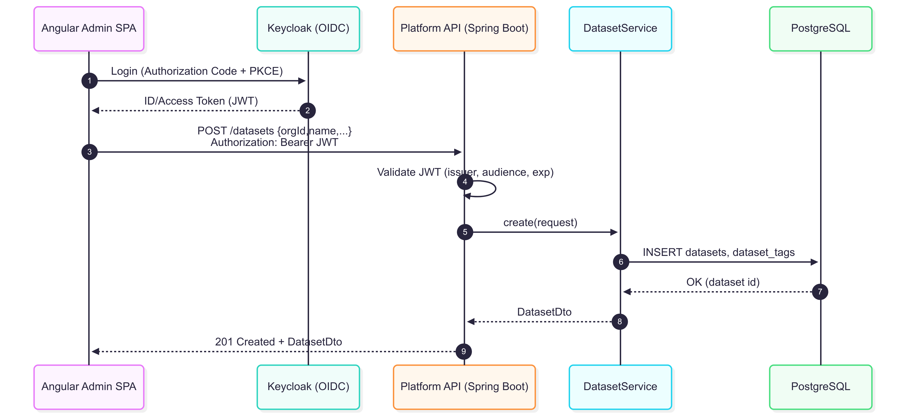
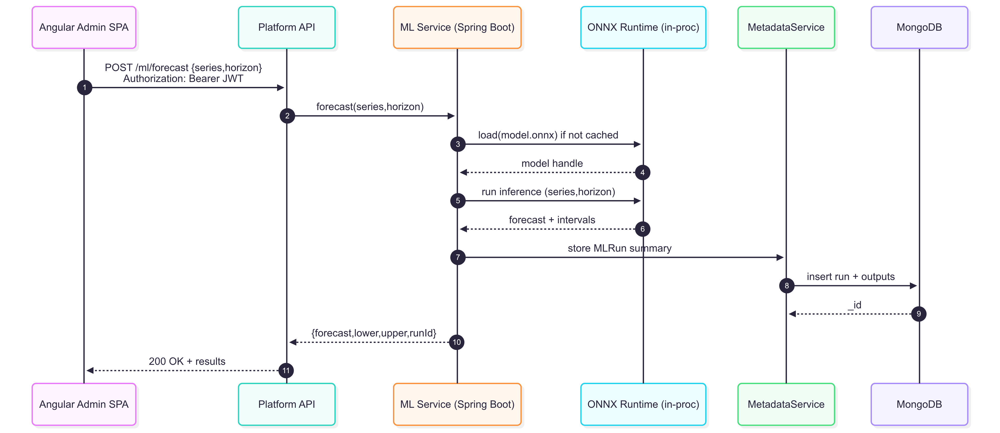
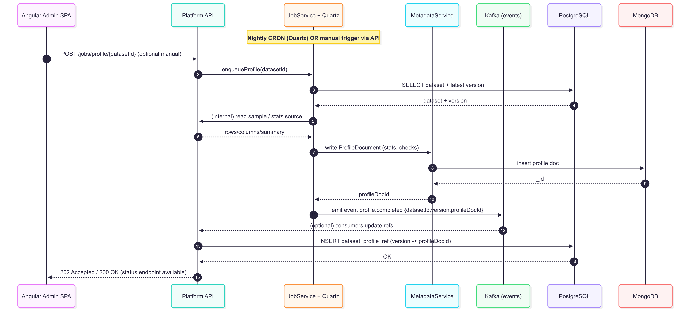

---

## title: Architecture

---

[🏠 Home](index.md) | [⚙ Setup](setup.md) | [📐 Architecture](architecture.md) | [📜 ADRs](ADRs/index.md) | [🔒 Security](security.md) | [📊 API Specs](api-specs.md) | [🤖 ML Module](ml-module.md) | [🖼 Diagrams](diagrams.md) | [📝 Changelog](CHANGELOG.md)

# Architecture

This document summarizes the current system architecture for the **Identity‑Aware Data Product Platform** backend and the planned Angular admin frontend. It will evolve as we implement features.

---

## Class Diagram (initial domain)


**Notes**

* `UserOrgRole` enables multi‑tenancy and role‑based access in an org context.
* `DatasetProfileRef` bridges SQL (Postgres) to profile documents stored in Mongo.

---

## Project Tree Structure (current)

```text
platform-api/
├─ pom.xml
├─ mvnw / mvnw.cmd
├─ HELP.md
├─ docs/
│  ├─ architecture.md               # this file
│  ├─ api-specs.md                  # REST endpoints / OpenAPI notes
│  ├─ security.md                   # IAM flow and roles
│  ├─ setup.md                      # local dev & deploy
│  └─ diagrams/                     # PNG/SVG exports and .mmd sources
│
└─ src/
   ├─ main/
   │  ├─ resources/
   │  │  ├─ application.yml         # datasource, JPA, redis/mongo configs
   │  │  └─ db/migration/           # Flyway migrations (V1__init.sql, …)
   │  └─ java/com/benjaminbatte/platform/
   │     ├─ PlatformApiApplication.java
   │     ├─ common/exception/       # GlobalExceptionHandler, custom errors
   │     ├─ config/                 # CORS, Jackson, Problem+JSON, etc.
   │     ├─ features/               # Feature-based modules
   │     │  ├─ dataset/
   │     │  │  ├─ domain/           # JPA entities
   │     │  │  ├─ dto/              # request/response DTOs
   │     │  │  ├─ mapper/           # MapStruct mappers
   │     │  │  ├─ repo/             # Spring Data JPA repos
   │     │  │  ├─ service/          # Service interfaces
   │     │  │  │  └─ impl/          # Service implementations
   │     │  │  └─ web/              # REST controllers
   │     │  ├─ org/                 # Orgs & roles
   │     │  └─ user/                # Users & auth
   │     ├─ jobs/                   # Quartz jobs
   │     ├─ metadata/               # Mongo docs/repos (profiles, checks)
   │     ├─ ml/                     # ML/analytics adapters
   │     └─ security/               # OAuth2/JWT resource server
   │
   └─ test/
      └─ java/com/benjaminbatte/platform/
         └─ PlatformApiApplicationTests.java

```

---

## Sequence Diagrams

### Create Dataset



### ML Forecast



### Run Profiling Job



---

[🏠 Home](index.md) | [⚙ Setup](setup.md) | [📐 Architecture](architecture.md) | [📜 ADRs](ADRs/index.md) | [🔒 Security](security.md) | [📊 API Specs](api-specs.md) | [🤖 ML Module](ml-module.md) | [🖼 Diagrams](diagrams.md) | [📝 Changelog](CHANGELOG.md)
