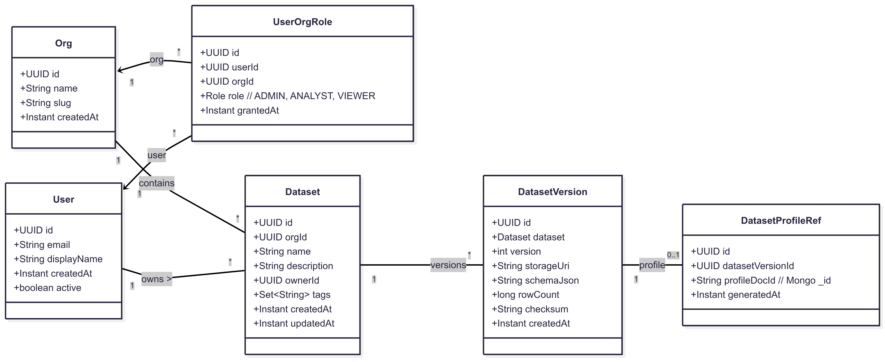

---

## title: Diagrams

---

[🏠 Home](index.md) | [⚙ Setup](setup.md) | [📐 Architecture](architecture.md) | [📜 ADRs](ADRs) | [🔒 Security](security.md) | [📊 API Specs](api-specs.md) | [🤖 ML Module](ml-module.md) | [🖼 Diagrams](diagrams.md) | [📝 Changelog](CHANGELOG.md)

# Diagrams

This page collects visual representations of the **Identity‑Aware Data Product Platform** architecture and workflows.

---

## 1) High‑Level System Architecture

**Description:**

* Angular frontend authenticates with Keycloak
* Spring Boot API Gateway with microservices for datasets, jobs, ML
* SQL (Postgres) and NoSQL (MongoDB) persistence
* Kafka for async workflows
* Redis cache
* Monitoring via Prometheus/Grafana

---

## 2) Domain Model

**Notes:**

* `UserOrgRole` enables multi‑tenancy
* `DatasetProfileRef` bridges Postgres ↔ Mongo

---

## 3) Service Interaction Flow

**Flow:**

1. User logs into Angular → Keycloak → obtains JWT
2. Angular calls backend with JWT
3. API Gateway routes requests → dataset/metadata/job/ML services
4. Services communicate via Kafka events
5. Results stored in Postgres/Mongo → rendered in Angular

---

## 4) Deployment Model

**Local:** Docker Compose (Postgres, Mongo, Redis, Kafka, Keycloak).

**Production:** Kubernetes with Ingress, HPA, ConfigMaps, Secrets.

---

## 5) Future Diagrams

* Sequence diagram for dataset profiling job lifecycle
* Swimlane diagram for multi‑tenancy access flows

---

[🏠 Home](index.md) | [⚙ Setup](setup.md) | [📐 Architecture](architecture.md) | [📜 ADRs](ADRs/index.md) | [🔒 Security](security.md) | [📊 API Specs](api-specs.md) | [🤖 ML Module](ml-module.md) | [🖼 Diagrams](diagrams.md) | [📝 Changelog](CHANGELOG.md)
