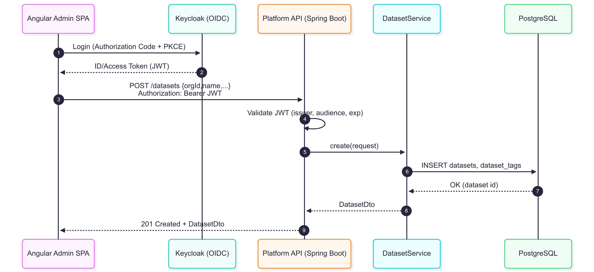
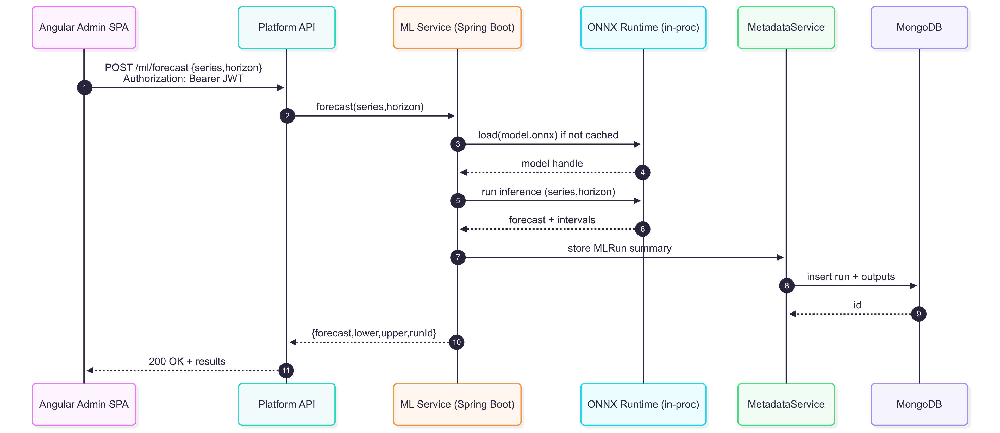

---

## title: Identity-Aware Data Product Platform Documentation

---

[🏠 Home](index.md) | [📖 Overview](overview.md) | [⚙ Setup](setup.md) | [📐 Architecture](architecture.md) | [📜 ADRs](ADRs/index.md) | [🔒 Security](security.md) | [📊 API Specs](api-specs.md) | [🤖 ML Module](ml-module.md) | [🖼 Diagrams](diagrams.md) | [📝 Changelog](CHANGELOG.md)

# 🔐 Identity-Aware Data Product Platform

*Secure, multi-tenant platform for data product management*

---

**Quick Start:** [Setup Guide →](setup.md)

---

## 📚 Documentation

### Core Documentation

* [Overview](overview.md) - Introduction & features
* [System Architecture](architecture.md) - Diagrams and project structure
* [API Specifications](api-specs.md) - REST endpoints and OpenAPI docs
* [Security Model](security.md) - IAM flow and roles

### Implementation Guides

* [Setup Instructions](setup.md) - Local dev & deployment
* [ML Module](ml-module.md) - Machine learning integration

### Reference

* [Changelog](CHANGELOG.md) - Version history
* [ADRs](ADRs/index.md) - Architectural Decision Records

---

## 📊 System Diagrams

| Diagram                                                | Preview                                                 |
| ------------------------------------------------------ | ------------------------------------------------------- |
| [Domain Class Diagram](diagrams/domain.png)            |             |
| [Create Dataset Sequence](diagrams/create_dataset.png) |     |
| [ML Forecast Sequence](diagrams/ml_forecast.png)       |        |
| [Run Profiling Job](diagrams/run_profiling_job.png)    |  |

---

[**Get Started** → Setup Guide](setup.md)

---

[🏠 Home](index.md) | [📖 Overview](overview.md) | [⚙ Setup](setup.md) | [📐 Architecture](architecture.md) | [📜 ADRs](ADRs/index.md) | [🔒 Security](security.md) | [📊 API Specs](api-specs.md) | [🤖 ML Module](ml-module.md) | [🖼 Diagrams](diagrams.md) | [📝 Changelog](CHANGELOG.md)

© 2025 Identity-Aware Data Product Platform • [GitHub Repo](https://github.com/BenjaminBatte/platform-api)
